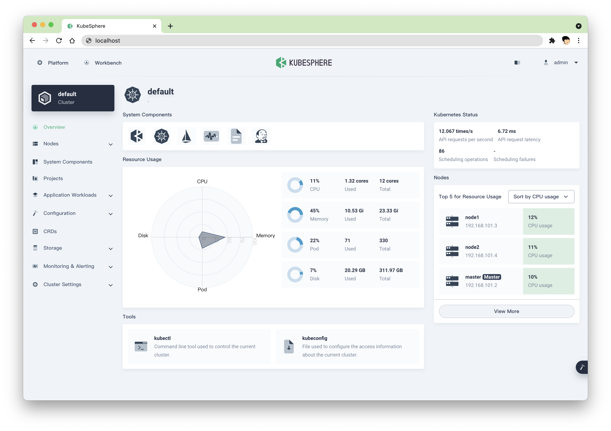

# sqk-super-kubenetes
[](https://gitpod.io/#https://github.com/super-kubenetes/console)
[](https://www.gnu.org/licenses/agpl-3.0)



## Getting Started

### Prerequisite
#### Node.js
Console is written using Javascript. If you don't have a Node.js development environment, please [set it up](https://nodejs.org/en/download/). The minimum version required is 12.18.4.

Recommend for NodeJs Version: 12.18.4

#### Yarn
We use [Yarn](https://yarnpkg.com/) to do package management. If you don't have yarn, use the following to install:
```
npm install -g yarn@1.22.4
```
The minimum version required is 1.22.4, but you can use a newer version.

#### [Optional]Docker
This is optional. If you just want to test and build on your local environment, there is no need to install docker. Otherwise, you need to install it.
[Install on Mac](https://docs.docker.com/desktop/mac/install/)
[Install on Windows](https://docs.docker.com/desktop/windows/install/)
[Install on Ubuntu](https://docs.docker.com/engine/install/ubuntu/)

#### [Optional]Make
This is optional too, we use `make` to reduce hand work, but it's totally ok without it.

## How to build

Clone the repository, and run `yarn install && yarn build`
```sh
git clone http://52.79.210.247:9000/sqk/sqk-super-kubenetes.git
cd sqk-super-kubenetes/
yarn install && yarn build
yarn start
```
> If you have trouble downloading the dependencies, try the following
>
> `yarn config set registry https://registry.npmmirror.com`


After `yarn start`, you should see the output like the following

```
> yarn run v1.22.4
> $ concurrently -k --raw "yarn dev:client" "yarn dev:server"
> $ cross-env NODE_ENV=development nodemon -w ./common -w ./server -e js,yaml server/server.js
> $ cross-env NODE_ENV=development webpack-dev-server --config scripts/webpack.dev.js -w
> 
> Dashboard app running at port 8000
```
